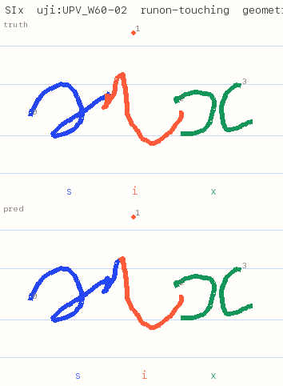
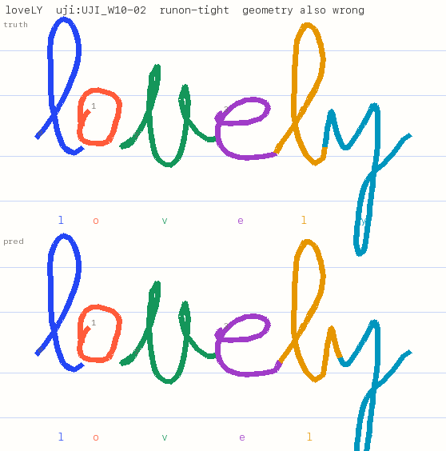
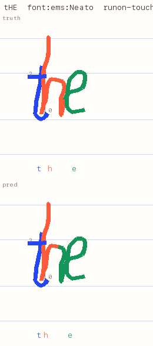
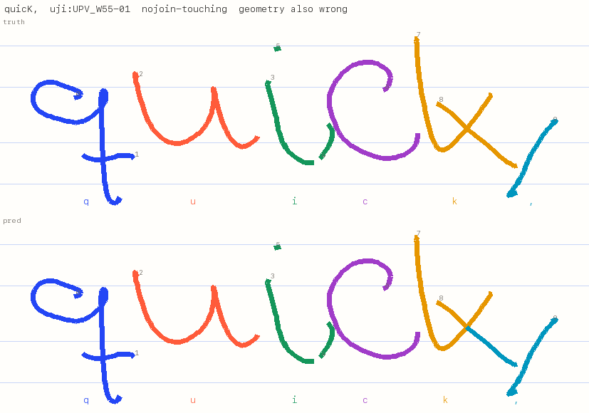
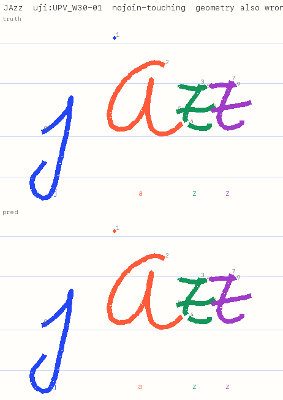

# Model card: your-own-font letter model

## What it does

A small convolutional network that runs on the phone, in the pipeline Web Worker, in our own
TypeScript (`packages/pipeline/src/letter-model/`). It takes one group of pen strokes and the
writing guides, and returns 32 log-probabilities: `a`–`z`, `,` `.` `'` `!` `?`, and `∅`, "not
exactly one letter".

The person is always told which word to write, so the model never reads handwriting. The
segmenter (`segment()`) asks it one narrow question: is this group of strokes exactly the
letter it would be if we grouped the strokes this way? The segmenter uses the answer to choose
which strokes make which letter, after every pen-up.

**It never rejects, blocks or corrects ink.** When no grouping fits, the product shows a
nudge (SPEC.md §6.3). The ink stays.

- File: `letter-model.bin`. Layout: `LMDL`, u32 header length, JSON header (architecture,
  class list, input spec, geometry priors, solver weights, training-data hash), fp16 tensors.
- Input: see docs/letter-model.md §3. A 40×32 raster framed by the guides (baseline − 2·xh to
  baseline + 1·xh), plus 7 scalars.
- Licence: MIT. The weights are trained only on sources that passed the licence gate
  (`DATA.md`); attributions are below.

<!-- metrics:start (generated by `uv run letter-model evaluate`) -->
### Classifier (held-out writers and styles, shipped fp16 weights)

| Test set | n | top-1 (31 classes, ∅ counts as wrong) |
|---|---:|---:|
| all held-out | 2626 | **93.49** |
| UJI writers (real, stylus) | 1488 | 91.8 |
| Omniglot drawers (real, mouse) | 208 | 95.19 |
| font styles (synthetic) | 930 | 95.81 |
| all held-out, ∅ ignored (argmax over letters) | 2626 | 95.2 |

| ∅ (not exactly one letter) | n | precision | recall |
|---|---:|---:|---:|
| negatives that are not letter-shaped | 7110 | 98.95 | 87.24 |
| negatives, only confident lookalikes excluded | 7548 | 98.97 | 83.94 |
| negatives, all (the spec's four types as generated) | 8000 | 98.97 | 79.3 |
| &nbsp;&nbsp;cut (14.48% of this type are letter-shaped) | 1524 | – | 83.73 |
| &nbsp;&nbsp;fragment (4.69% of this type are letter-shaped) | 1869 | – | 88.01 |
| &nbsp;&nbsp;merged (1.09% of this type are letter-shaped) | 2088 | – | 98.32 |
| &nbsp;&nbsp;missing (24.09% of this type are letter-shaped) | 1629 | – | 75.45 |

The two targets pull against each other through the ∅ margin (letter-shaped negatives excluded):

| Operating point | top-1 | ∅ precision | ∅ recall |
|---|---:|---:|---:|
| shipped (margin chosen on validation) | 93.49 | 98.95 | 87.24 |
| best top-1 with ∅ recall ≥ 90% | 92.5 | 98.45 | 91.03 |
| best ∅ recall with top-1 ≥ 95% | 95.13 | 99.84 | 63.16 |

Real letters called ∅: 2.51%. Most common confusions: n→m (9), i→∅ (8), v→∅ (7), l→∅ (7), x→∅ (5), y→g (4), ?→! (4), c→∅ (4).

### Segmentation (held-out synthetic words, per-letter exact match, %)

| Subset | letters | model | geometry | live gap rule |
|---|---:|---:|---:|---:|
| all | 7008 | **94.89** | 89.58 | 42.68 |
| wide spacing | 2336 | **97.82** | 94.14 | 67.94 |
| tight spacing | 2336 | **95.12** | 88.31 | 39.85 |
| touching / overlapping | 2336 | **91.74** | 86.3 | 20.25 |
| run-on strokes (one stroke, two letters) | 1373 | **79.53** | 71.38 | 16.82 |
| dots and crossbars written last | 2470 | **94.37** | 88.38 | 38.46 |
| UJI writers | 4320 | **94.51** | 90.37 | 43.7 |
| font styles | 2160 | **95.83** | 88.94 | 40.69 |
| Omniglot drawers | 528 | **94.13** | 85.8 | 42.42 |
| after every pen-up (finished letters) | 8908 checks | **95.39** | 82.72 | – |

Second word list (60 other common words, incl. `' ! ?`): model 93.77%, geometry 88.7%, live rule 44.8% (8979 letters).

### Size

66800 weights, `letter-model.bin` 134.8 KB, **123.9 KB gzipped** (budget 300 KB).

### Latency (tools/bench, headless, this Mac: Apple M4 Pro)

| Browser | per candidate p50 / p95 (ms) | per pen-up re-solve p50 / p95 (ms) | cold whole-word re-solve p50 / p95 (ms) |
|---|---:|---:|---:|
| chromium | 0.098 / 0.112 | 0.40 / 1.20 | 2.00 / 4.40 |
| chromium 4x | 0.427 / 0.488 | 1.90 / 5.30 | 9.00 / 19.30 |
| webkit | 0.071 / 0.086 | 0.00 / 1.00 | 1.00 / 3.00 |

<!-- metrics:end -->

## Against the phase 1 targets (docs/letter-model.md §7)

| Target | Result | |
|---|---|---|
| One command, ≤ 60 min | `./packages/letter-model/reproduce.sh`: 15–19 min on an M4 Pro | ✅ |
| Classifier top-1 ≥ 95% on held-out writers | **93.5%** (UJI 91.8%, Omniglot 95.2%, fonts 95.8%) | ❌ 1.5 points short |
| ∅ precision and recall ≥ 90% | precision 99.0%, **recall 87.2%** on negatives that aren't letter-shaped (79.3% on every generated negative) | ❌ recall 2.8 points short |
| Model beats geometry on held-out words, incl. touching | 94.9% vs 89.6% (touching: 91.7% vs 86.3%) | ✅ |
| Parity: raster ≤ 1/255, logits ≤ 1e-3 | 5e-7 per pixel, 4e-6 | ✅ |
| Weights ≤ 300 KB gzipped | 124 KB | ✅ |
| Speed: ≤ 0.5 ms per candidate, ≤ 8 ms p95 per re-solve (phone class) | Chromium at 4× throttling: per candidate p50 0.43 / **p95 0.49–0.52 ms** across runs; per pen-up re-solve p95 5.3 ms. Built-in browser, unthrottled: 0.10 / 0.11 ms and 1.2 ms | ⚠️ per candidate is right on the line; re-solve ✅ |
| Collection tool end to end | Records, review and fix, saves; the file validates (driven by hand in the built-in browser, and headless from `file://` on every run) | ✅ |

**Why the classifier targets are missed, in numbers.** The two targets pull against each
other through the ∅ margin. Keeping ∅ recall ≥ 90% costs top-1 (92.5%); keeping top-1 ≥ 95%
costs ∅ recall (63%). The spec's starting network, 45× more compute than the budget allows,
reaches 94.6% top-1 with 90.7% ∅ recall on the same test: close, but still short. The limit
is the held-out UJI writers' letters (91.8% top-1). Many of their errors are shapes a person
would also misread out of context, like an `n` with an entry stroke (reads as `m`) or a
cursive `b` (reads as `lr`); see `report/failures/classifier-sheet.png`. On the ∅ side, the
weakest type is *missing* (75% recall): many unfinished letters still look like some other
letter even after the stricter exclusion rule. More, and more varied, real writers is the
lever, which is phase 2. For the product, the
number that matters is segmentation, where the model beats geometry on every subset.

## Training data

All the sources below are permissive (`DATA.md` has the licence text and the rejected
sources). No real handwriting from our own users is in this model yet.

- **UJI Pen Characters v2** (CC BY 4.0). Prat, F., Castro, M., Llorens, D., Marzal, A., &
  Vilar, J. (2008), UCI Machine Learning Repository, https://doi.org/10.24432/C5FG8S.
  60 writers with a tablet stylus. 42 writers train, 6 validate, 12 test. We resampled the
  samples, placed them on our guides and augmented them.
- **Omniglot, Latin alphabet** (MIT, © 2015 Brenden Lake; Lake, Salakhutdinov & Tenenbaum,
  *Science* 2015). 20 drawers with a mouse, lowercase only. Drawers 1–15 train, 16 validates,
  17–20 test.
- **Hershey fonts**, Roman Simplex and Script Simplex. "The Hershey Fonts were originally
  created by Dr. A. V. Hershey while working at the U. S. National Bureau of Standards. The
  format of the Font data in this distribution was originally created by James Hurt,
  Cognition, Inc."
- **EMS single-line fonts** (SIL OFL 1.1), by Sheldon B. Michaels and Windell H. Oskay after
  the upstream OFL designs: CasualHand, Tech, Delight, Pancakes, Neato, Bird, Felix, Allure,
  Pepita, Readability, Readability Italic, Nixish, Herculean. Tech, Neato and Readability
  Italic are held out for test; Pancakes for validation.
- **Relief SingleLine** (OFL 1.1, © 2022 The Relief SingleLine Project Authors).
- **Cutlings Singularis** (OFL, Ellen Wasbo).
- The **house hand** from `design/homepage-prototype.html` (ours).

Synthetic words are composed from these glyphs, in the fixture format:

- spacing from wide to overlapping;
- a baseline that drifts;
- dots and crossbars written last in 35% of words;
- the pen running on into the next letter where that is natural.

The model also trains on the exact candidate groups the product's segmenter proposes for those
words, including half-written words.

## Training recipe

1. **Clean the ∅ labels.** docs/letter-model.md §4 sets out the rules. Generated negatives
   that are really another letter (an `h` stem is an `l`) are dropped as ∅ examples.
2. **Teacher.** The spec's starting architecture: about 9M multiply-adds, too slow to ship.
3. **Student.** `dsflat`, distilled from the teacher (temperature 2, teacher weight 0.85),
   trained for 40 epochs. The student is about as good as the teacher on top-1: 94.5% vs
   94.6% on the same test, at each one's calibrated margin.
4. **∅ margin.** Subtracted from the ∅ logit, chosen on validation letters and negatives,
   and folded into the last bias at export.
5. **Solver weights.** Tuned on validation words: geometry mode first, then how much geometry
   the model mode adds, then the leniency for the letter being written.

<!-- failures:start -->
## Failure cases

Each image shows the truth on top and the model's grouping below; colours are letters. The
letters it got wrong are in capitals in the title. All five come from held-out writers or
styles.

1. 
   **"SIx"**, UJI writer UPV_W60 (held out). The `s` runs on into the `i`. The cut lands too
   early, so the `i` takes the tail of the `s`.
2. 
   **"loveLY"**, UJI_W10. The `l` loops straight into the `y`, and the cut lands in the wrong
   place on the connector.
3. 
   **"tHE"**, EMS Neato (held-out font), overlapping. The `h` is drawn over the `t`'s crossbar
   and runs into the `e`, and the arch of the `h` goes to the `e`.
4. 
   **"quicK,"**, UPV_W55, touching. The `k`'s lower leg reaches over the comma. The solver
   cuts it and gives the end of the leg to the comma.
5. 
   **"JAzz"**, UPV_W30, touching. The `j`'s dot drifted over the `a`, and went to the `a`.

**What they have in common:** the ink in dispute sits between two letters: a run-on
connector, an exit tail, a leg crossing into the neighbour's space, a dot that drifted. Both
ways of grouping it make plausible letters, a dotless `j` is still a `j`, so the model
can't separate them and weak geometry decides. Geometry mode gets four of these five wrong
too. Run-on strokes cause 77% of the remaining failed words (120 of 156). Our run-on
connectors are synthetic (a short two-segment hop from one letter's end to the next letter's
start), which is the least realistic part of the data. That is exactly what phase 2's real
writers should fix.

Contact sheets with more cases: `report/failures/segmentation-sheet.png` and
`report/failures/classifier-sheet.png`. Most classifier errors are idiosyncratic shapes:
`n` with an entry stroke read as `m`, a cursive `b`, `s` written like `z`, a 9-shaped `q`.

## Operating notes

- **"Nothing fits"** (SPEC.md §6.3) fires when P(expected letter) < 0.02 and P(∅) > 0.5.
  - On validation words it flagged 14 of 504 words. All 14 were wrong, at the flagged letter,
    so no false alarms. It caught 30% of the 47 wrong words.
  - Looser thresholds catch more but start to cry wolf: at 0.05, 34% caught with 4 false
    alarms in 20 flags; at 0.1, 49% with 16 in 39.
  - Because the nudge holds the word until it's resolved, the threshold stays strict. If
    the nudge ever becomes non-blocking, 0.05 is worth a look.
- **Speed.**
  - Most of the time is the network (~90 µs per candidate in V8 on an M4 Pro). The
    rasterizer takes ~12 µs, the solver itself ~0.1 ms per word.
  - After a pen-up, the solver scores only the new groups: 4.5 on average, 11 at p95. The
    per-word score cache stays valid through undo and redo-letter, because entries are keyed
    by the ink itself: 30 of 30 words gave the same answer as a fresh solve.
  - A cold re-solve of a whole word scores about 20 groups (40 at p95). That misses 8 ms at
    4× throttling (p95 19 ms), but the product never needs one: the cache is kept for the
    whole word.
  - Pathological input is slow. 40 short strokes for "together" took 17 ms on this Mac,
    about 70 ms at 4×. It runs in the worker, so nothing freezes, but the fill settles late.
<!-- failures:end -->

## Known limits

- **No real writers from our own guided flow yet.** Every segmentation number here is on
  synthetic words built from real and synthetic letters. Phase 2 (at least 20 real writers,
  docs/letter-model.md §7) is the real test. `tools/collect/index.html` records the data for it.
- **Stylus and mouse only.** UJI writers used a stylus and Omniglot drawers a mouse. Nobody
  in the training data wrote with a finger on a phone, which is the product's main pen.
- **Lowercase print only**, as the product asks. Cursive is out of scope.
